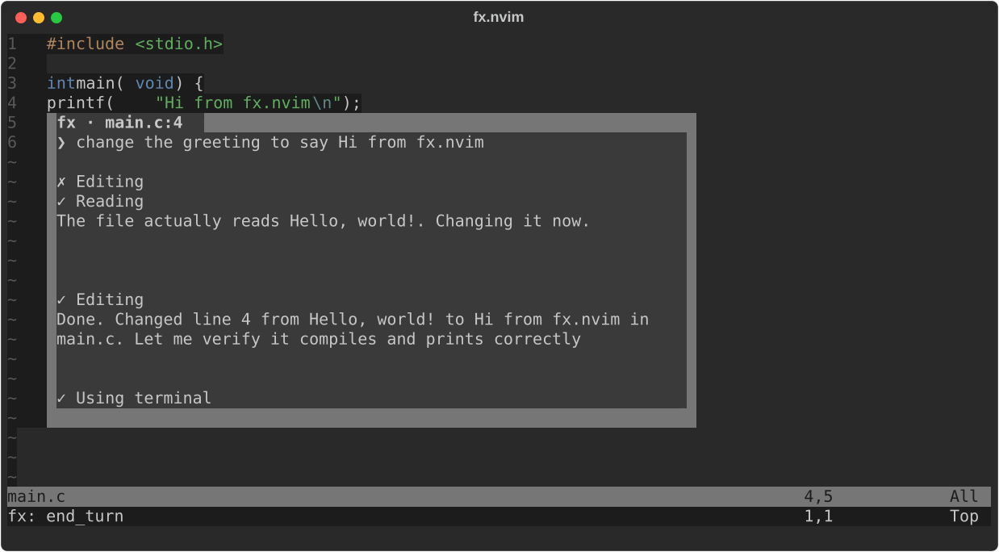

# fx.nvim

Use [fx](https://github.com/vercel-labs/fx.git) in neovim:



## Installation

Requires the [fx](https://github.com/vercel-labs/fx.git) CLI on your `$PATH`.

With [lazy.nvim](https://github.com/folke/lazy.nvim):

```lua
{
  "stanfish06/fx.nvim",
  cmd = "Fx",
  opts = {},
}
```

With built-in `vim.pack` (Neovim 0.12+):

```lua
vim.pack.add({ "https://github.com/stanfish06/fx.nvim" })
```

## Configuration

lazy.nvim:

```lua
{
  "stanfish06/fx.nvim",
  cmd = "Fx",
  opts = {
    border = "rounded",
    output = { width = 80 },
  },
}
```

Standard:

```lua
require("fx").setup({ border = "rounded" })
```

Defaults (see [config.lua](./lua/fx/config.lua))

## Commands

| Command | Action |
| --- | --- |
| `:Fx` | open the prompt overlay at the cursor (visual selection becomes context) |
| `:Fx ask <text>` | send a request directly, skipping the overlay |
| `:Fx stop` | stop the running turn |
| `:Fx restart` | restart fx |
| `:Fx rewind` | show the last request/response transcript |
| `:Fx history` | pick a past prompt and view its transcript |
| `:Fx list` | list fx sessions |
| `:Fx model` | pick the model |

## Key binds

| Where | Key | Action |
| --- | --- | --- |
| prompt overlay | `<CR>` | submit |
| prompt overlay | `q` / `<Esc>` | cancel |
| transcript hover | `q` / `<Esc>` | close |

## Color groups

| Group | Controls | Default link |
| --- | --- | --- |
| `FxNormal` | hover window text/background | `NormalFloat` |
| `FxBorder` | hover window border | `FloatBorder` |
| `FxTitle` | hover window title | `FloatTitle` |
| `FxSpinner` | request-line spinner | `DiagnosticVirtualTextInfo` |
